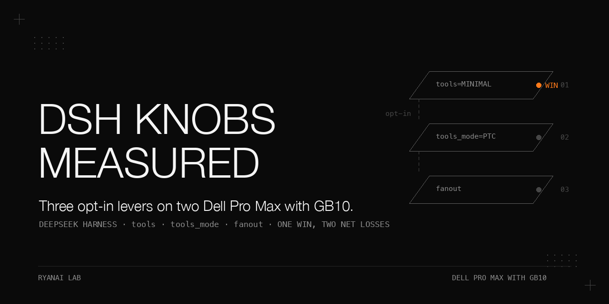

# Three opt-in knobs on DeepSeek Harness (dsh) — two Dell Pro Max with GB10

> A measured test of the three community-proposed "make dsh stronger" levers — per-job tool hiding (`tools=minimal`), programmatic tool calling (`tools_mode=ptc`), and workflow fan-out — wired into the packet schema of DeepSeek Harness (dsh) at the **rc.1** baseline, on two Dell Pro Max with GB10 nodes serving V4-Flash locally over a RoCE link as head node + worker node (TP2). Each lever was tested with a same-task A/B script whose pass/fail thresholds were fixed **before** running, and negative results were recorded as-is without moving the thresholds. Only one knob was an unambiguous win; two were net losses; and two structural traps — a provider-layer timeout/retry storm and a per-agent output-budget ceiling — turned out to be the real story behind fan-out's failures. Every number below is the result recorded for this run, with its measurement condition attached; engine-level measurements can be reproduced by readers with the published flags, private-bank scores are reported only.

## Why this matters

Opt-in knobs are only useful if you know which ones pay for themselves. `tools=minimal` quietly saves ~41% of the first-request prompt and drops the exposed tool set from 24 to 10 — a real win for read-only audit packets. But `tools_mode=ptc` and `fanout` both *cost* more than they give on this hardware, and the reasons are structural rather than fixable by tuning: a single local endpoint means fan-out parallelism cannot save wall time, and a per-agent output budget means fan-out could not rescue the 15-document audit under every arrangement we tried (sequential, fan-out 2, fan-out 4). Worse, fan-out's first two runs *looked* like knob failures but were really a provider-layer timeout shorter than the longest measured generation, multiplied by silent retries — a trap that will bite anyone who wires fan-out onto a provider with default timeouts. This cookbook records the levers, the negative results, and the two traps so the defaults (all off) are defensible.

## Hardware and stack

| | |
|---|---|
| Nodes | Head node and worker node, each a **Dell Pro Max with GB10**; the two-node layout is head node + worker node, TP2 over RoCE. The knob measurements ran on a single local endpoint. |
| Work layer | DeepSeek Harness (dsh), package `@deepseek-ai/dsh`, baseline behavior at **rc.1** |
| Served model | V4-Flash, served locally on the GB10 nodes |
| Provider tiers | three tiers: a fast tier, a planning tier and a long-context tier, kept in sync |
| Pass-through surface | packet schema fields `tools` / `tools_mode` / `fanout`; capability cards; CLI flags `--tools`, `--tools-mode`, `--fanout`; board-card body lines |
| Provider timeout/retry policy (final) | `timeoutMs: 600000`, `retryPolicy.maxRetries: 1` — applied identically to the fast/planning/long-context tier providers (see §Results) |
| Output budget / retention tooling | fast tier (thinking off) caps each agent at maxTokens 8192 |
| Image digests | none present in sources |

If a launch command or prerequisite is not recorded, this cookbook says so explicitly rather than guessing.

## Procedure as run

1. Fix an A/B pass/fail threshold per lever **before** running anything; write one same-task A/B script per lever. Do not move the thresholds after seeing results.
2. **`tools=minimal` vs standard**: measured on the first request of one fixed task, two runs, with the prompt size verbatim-identical between runs. Count the exposed tools and the first-request prompt size on each side. (The exact CLI invocation used to dump the prompt size is not recorded — reproduce by running the same packet with `--tools minimal` vs default and diffing the first request.)
3. **`tools_mode=ptc` vs native**: one fixed multi-step task, 12 rounds on each side, correctness judged by a deterministic check (the check definition is not published). Compare correctness (rounds passed) and median token/wall cost.
4. **`fanout`**: task = "review four small files for one risk each"; one run per arm. Workers run on the fast tier (peak concurrency observed 4); a checker runs on the planning tier with thinking on; plain sub-agents are forbidden. Assert the mechanism with post-hoc telemetry (see the `fanout` row conditions in Results).
5. Root-cause any fan-out timeouts **before** blaming the knob: the first two fan-out runs timed out because of the provider-layer default timeout + silent retries, not the fan-out mechanism. Apply the timeout/retry policy in §Results before re-running.
6. **Output-budget ladder**: with the same mechanism, task = audit 15 long cookbooks, run as sequential, fan-out 2, and fan-out 4. Control = the same mechanism on the original 4-small-files task. Results in §Results.
7. **Retention**: run reclamation in dry-run-by-default mode over the three append-only directories; perform one monitored real delete first, then enable the weekly scheduled job. Rollback is documented in §Results.

Exact per-tier provider config file paths, hook file names, scheduler job labels, and internal directory layouts are not published here; the policy values and the rollback method are recorded in §Results, which are what matter for reproduction.

## Results

Baseline for all three knobs = rc.1 defaults: `tools` standard, `tools_mode` native, no `fanout`. Full tables with measurement conditions are in `docs/results.md`; the summary:

### The three knobs

| Knob | Measurement condition | Result | Verdict |
|---|---|---|---|
| `tools=minimal` | first request of one fixed task, two runs, prompt size verbatim-identical | tool set 24→10; prompt −41% | Recommended for read-only audit packets, only if the packet needs no iterative-loop tool / sub-agent delegation |
| `tools_mode=ptc` | one fixed multi-step task, 12 rounds each, native vs ptc, correctness by a deterministic check (not published) | correctness native 9/12 vs ptc 11/12 — but the last 8 rounds were 8/8 for both sides; median tokens +33%; wall +45% | Not default: on this task the accuracy edge of ptc did not hold in the last eight rounds (8/8 both) while the token cost stayed +33%; enable per-need only for batch-statistics tasks where the native model would guess numbers |
| `fanout` | "review four small files for one risk each"; 4 fast-tier workers + 1 planning-tier checker, single local endpoint, one run per arm; wall and total tokens summed over root + worker sessions; mechanism checks: workflow called exactly once, plain sub-agent calls 0, per-item retries ≤1, no unfinished items, checker completed, peak concurrency ≤4 | mechanism fully worked; wall 2.0×; total tokens 4.8× | Not default: on one local endpoint fan-out did not save wall time on this small task (checker long-tail thinking + each worker re-reads context); whether a single endpoint benefits from fan-out depends on item count and is not established by this one four-file run |

### The provider-layer timeout/retry trap (fan-out root cause)

| Item | Value |
|---|---|
| pi-ai provider-layer defaults | timeout 60 s, retries 5 — a single generation over the default was judged failed and silently retried 5×; first true root cause of the two early fan-out timeouts |
| Longest single generation measured | ~200 s (the checker, planning tier, thinking on) |
| Final policy (applied identically to fast/planning/long-context tier providers) | `timeoutMs: 600000`, `retryPolicy.maxRetries: 1`; rule: the total time for a call (timeout × (1 + retries) plus backoff and overhead) must stay clearly smaller than the packet wall; multiple calls in one packet need their budget summed |
| Iteration note | first version set 900 s; a review caught that 900×2 would collide with the wrapper's default wall of 1800 s (600×2=1200 stays below), so it was lowered to 600 s |
| Real hangs | handled by the wrapper's wall timeout (exit 124), not by provider-layer retries |
| Rollback | `git checkout` the three per-profile provider config files restores the old default pair |

### The per-agent output-budget limit (fan-out hard constraint)

| Item | Value / condition |
|---|---|
| Budget | fast tier (thinking off) caps each agent at maxTokens 8192; V4-Flash writes its reasoning into the content channel for "long document + open-ended judgment," burning the budget |
| 15-cookbook audit | the 15-document audit failed under every arrangement we tried (sequential, fan-out 2, fan-out 4) within an 8,192-token per-agent output budget; smaller allocations per agent were not tested; coverage 0/15 |
| Control | the same mechanism on 4 small library files passed completely |
| Cost scale | 1.3–1.8M tokens per variant (no external API token cost; local run cost not recorded) — 10× the small-task fan-out |
| Honest conclusion boundary | data supports only "fast tier ≥ 4 long READMEs per agent is infeasible"; 1–2 books per agent and planning-tier workers are undecided (the exploratory run was masked by a root-model allocation error; root cause not fully investigated). No threshold was written into any capability or template; next real task: dispatch 1 long item per agent, or prove a single planning-tier item first |
| Outcome note | the risk table for that run was not produced (no fabrication) |

### GC retention

| Item | Value / condition |
|---|---|
| Targets | three append-only directories (worktrees, per-job session evidence, outputs), reclaimed by directory mtime; cleanup defaults to dry-run, `--apply` deletes |
| Evidence-chain rule | directories referenced by the A/B ledger, plus the session dirs whose job ids appear in their JSONs, are kept for `EVIDENCE_DAYS` = 180 days; everything else by `DAYS` (a permanent exemption was unanimously rejected on review) |
| Traceability | every dir gets an `intent` ledger line before deletion, then a `delete` / `delete-failed` line after; each run writes a `run` summary line — the garbage collector writes an intent record before deleting and a completion record after, so a deletion without a record would require both writes to fail |
| Fail-closed | missing interpreter or any break in the evidence-chain parsing pipeline → refuse to run (exit 3, better not to delete); paths use NUL-safe traversal + absolute-prefix assertions |
| First monitored real run | `DAYS=3` deleted 84 directories (with a tar backup), then automation was enabled |
| Schedule | weekly scheduled job, Sunday 04:30, `DAYS=30`; rollback = remove the job label |

## What did not work

| Negative result | Where the numbers are |
|---|---|
| ptc correctness advantage (native 9/12 vs ptc 11/12 collapses to a tie on the last 8 rounds) while median token and wall costs rise | three-knobs table |
| fan-out as a wall-time saver on small tasks on a single local endpoint (and its token blow-up) | three-knobs table |
| The first two fan-out runs (provider-layer timeout + silent retry storm) | timeout/retry table |
| The initial 900 s timeout value (would collide with the wrapper wall) | timeout/retry table |
| 15-book audit under every parallelism setting (max-tokens / timeout, zero coverage) | output-budget table |
| Any threshold generalization from the ladder — explicitly declined for lack of data | output-budget table |

## Pitfalls

Symptom → root cause → fix, expanded with how each was found in `docs/pitfalls.md`. Summary:

- Fan-out workers "randomly fail" on long generations → provider-layer default timeout shorter than the longest measured generation × silent retries → one long provider timeout, max-retries 1, always clearly below the packet wall; let the wrapper's wall timeout catch true hangs.
- A worker's JSON answer is ignored and the agent resolves null → schema-bound agents only accept tool-call delivery; JSON in the text body counts as failed → deliver via the structured-output tool, one labeled retry on null; a null checker must throw, never pass silently.
- The workflow tool rejects the call → the model nested `args` inside `meta` → keep `script` / `meta` / `args` as three top-level parameters.
- Fan-out total tokens "missing" child work → an early unit test polluted the real per-job session index with a one-event fake session → count root + all child sessions (children persist under per-job dirs); the unit test now cleans up.
- Believing fan-out "enforces" a bounded envelope → it is a prompt contract plus post-hoc telemetry assertions only → treat it as opt-in experimental; real safety stays in hooks + sandbox + read-only/worktree boundaries.
- Long-document agents die at max-tokens regardless of parallelism → per-agent output budget, reasoning written into the content channel → cap long items per agent (start at 1) or move the worker to the planning tier; fan-out is not a budget workaround.
- Fear that automated disk reclamation silently destroys evidence → untracked deletes and unresolved evidence chains → dry-run default, ledger lines around every delete, fail-closed refusal on parse breakage, evidence retention period distinct from the general one.

## Files

- `README.md` — this cookbook
- `docs/results.md` — every results table from the run, complete, with a one-line measurement-condition note above each
- `docs/pitfalls.md` — the seven pitfalls expanded (symptom / root cause / fix / how we found it)
- `docs/make_banner.py` — pure-PIL banner generator (house style); run it to write `docs/assets/banner.png`
- `docs/assets/banner.png` — generated by `docs/make_banner.py` (not committed by this cookbook)

## License

Apache-2.0.
